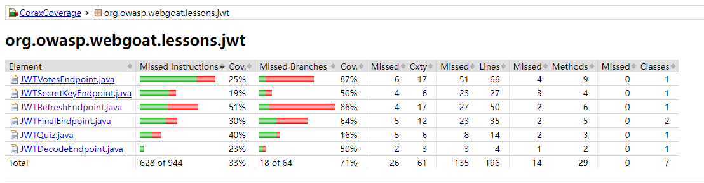
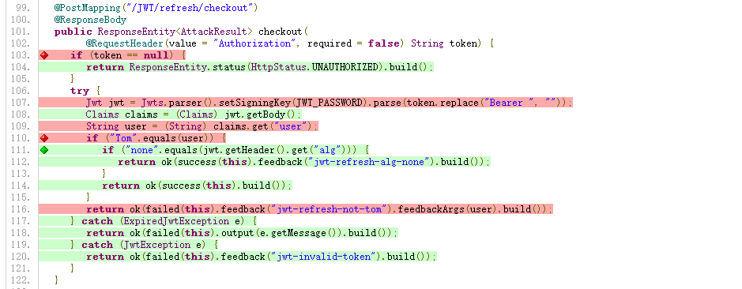

# CoraxJava Usage

**Table of contents**

<!-- toc -->

- [Analysis Overview](#analysis-overview)
- [Prerequisite Knowledge](#prerequisite-knowledge)
  * [`class` Classification](#class-classification)
- [Command Line Parameters](#command-line-parameters)
  * [--target [java|android|src-only]](#--target-javaandroidsrc-only)
  * [--android-platform-dir](#--android-platform-dir)
  * [--auto-app-classes](#--auto-app-classes)
  * [--process](#--process)
  * [--class-path](#--class-path)
  * [--source-path](#--source-path)
  * [--disable-analyze-library-classes](#--disable-analyze-library-classes)
  * [--project-config](#--project-config)
  * [--serialize-cg](#--serialize-cg)
  * [--enable-coverage](#--enable-coverage)
  * [--make-scorecard](#--make-scorecard)
- [Common Use Cases](#common-use-cases)
  * [Java Sec Code](#java-sec-code)
    + [Step One: Compile](#step-one-compile)
    + [Step Two: Observe the types of compilation output](#step-two-observe-the-types-of-compilation-output)
    + [Step Three: Write analysis command](#step-three-write-analysis-command)
  * [Alibaba: Nacos](#alibaba-nacos)
    + [Step 1: Compilation](#step-1-compilation)
    + [Step 2: Observe the Compilation Output Types](#step-2-observe-the-compilation-output-types)
    + [Step 3: Write Analysis Command](#step-3-write-analysis-command)
  * [Fat Jar](#fat-jar)
  * [Gradle Projects](#gradle-projects)
- [Android App](#android-app)
- [Results Output](#results-output)
  * [False Positive/Negative Forms](#false-positivenegative-forms)
  * [Missing Dependencies](#missing-dependencies)
  * [Unmodeled Methods](#unmodeled-methods)
  * [Detailed Logs](#detailed-logs)
- [Frequently Asked Questions](#frequently-asked-questions)

<!-- tocstop -->

## Analysis Overview

CoraxJava consists mainly of two parts: the `CoraxJava Core Analysis Engine` and the `CoraxJava Rule Checker`. The `CoraxJava Core Analysis Engine` is not open source and can be downloaded as a JAR file for direct execution. This project focuses on the `CoraxJava Rule Checker` module. After successful compilation and build (with the specification of the `CoraxJava Core Analysis Engine` file path), it generates corresponding analysis plugins and configuration files.

The input for the CoraxJava static analysis tool includes: compiled Java bytecode class files (`.class/.jar/.war/.apk/.dex`), source code files of the analyzed project, and various resources and configuration files required by CoraxJava.

1. **Java Source Code Project to be Analyzed**: It is recommended to ensure that the project is complete, as CoraxJava can analyze some configuration files of the project. Additionally, the source code of other third-party libraries that the project depends on is not mandatory.
2. **Java Bytecode Class Files of the Project**: The bytecode files in various forms compiled from the Java source code are the main analysis objects for CoraxJava, and thus, they are essential. For uncompiled Java projects, manual compilation is required to generate the corresponding bytecode or binary artifacts. For example, for a Maven project, execute ```mvn package``` and for a Gradle project, execute ```gradle build```.
3. **CoraxJava Resources and Configuration Files**: Building this project using Gradle (CoraxJava Rule Checker module) will automatically generate the necessary rule checker plugins and configuration files for running CoraxJava analysis. During CoraxJava analysis, load the configuration file, and the CoraxJava core analysis engine will automatically find the corresponding plugins and other configuration files for static analysis.


## Prerequisite Knowledge

### `class` Classification

Firstly, understanding the classification of `class` in CoraxJava is essential. Generally, for static analysis, the classes of the analyzed Java application are collectively referred to as `runtime classes`. `Runtime classes` can be classified into three types:

- **Application Classes**: These are user project classes, also known as `ApplicationClasses`. Typically, after the project is compiled, classes corresponding to user-written source code are classified as `ApplicationClasses`.
- **Library Classes**: These are classes from third-party libraries, also known as `LibraryClasses`. Dependencies of the project are categorized as `LibraryClasses`.
  - Among them, classes from the default Java Runtime Environment (`JRE`) are referred to as `JavaLibraryClasses`, a specific type of `LibraryClasses`.
- **Phantom Classes**: These are classes that cannot be found, also known as `PhantomClasses`. If the project code references a class, but CoraxJava cannot locate it in the input resources, it is classified as a `PhantomClass`.


**Note: Understanding the classification of `class` is crucial for correctly using CoraxJava's command-line parameters. Remember and understand the meanings of `ApplicationClasses`, `LibraryClasses`, etc. during analysis.**

**Note: During analysis, provide as complete `runtime classes` as possible to reduce the number of `PhantomClasses` and improve the accuracy of analysis results (fewer false positives and false negatives).**


## Command Line Parameters

The execution of `CoraxJava` involves using the Java runtime to execute the JAR file of the `CoraxJava Core Analysis Engine`, specifying analysis targets, configuration files, etc. The `CoraxJava Core Analysis Engine` will automatically find the corresponding `CoraxJava Rule Checker` plugin based on the configuration file. The main parameters are illustrated below:


For simple usage, refer to [Readme.md#Configure-Parameters](/Readme.md#configure-parameters). The complete set of parameters is as follows (some less important options have been omitted):

```YAML
Usage: CoraxJava [<options>]

Java Target Options:
  --custom-entry-point=<method signature, signature file>
                               Sets the entry point method(s) for analysis.
  --make-component-dummy-main  Simple entry point creator that builds a
                               sequential list of method invocations. Each
                               method is invoked only once.
  --disable-javaee-component   Disable creating the JavaEE lifecycle component
                               methods.

Android Target Options:
  --android-platform-dir=<path>  Sets the android platform directory or path of
                                 android.jar. The value of environment variable
                                 "ANDROID_JARS" is also accepted. (required)
  --one-component-at-atime       Set if analysis shall be performed on one
                                 entry of (Android component/Web application)
                                 at a time.

Dump DefaultConfigOptions Options:
  --dump-default-config=<dir of analysis-config>
    Set the analysis-config directory path (required).

FlowDroid Options:
  --enable-flow-droid=<bool>     Set if the FlowDroid engine shall be enabled
                                 (required).
  ...

Data Flow Options:
  --enable-data-flow=<bool>  Set if the DataFlow engine shall be enabled
                             (required).
  --enable-coverage          Turn on static analysis code coverage reporting
                             with Jacoco.
  --source-encoding=<text>   The encoding of coverage source files used by
                             Jacoco (default: utf-8).
  ...

UtAnalyze Options:
  --enable-ut-analyze=<bool>  Set if the UtAnalyze engine shall be enabled
                              (required).

Options:
  --version                      Show the version and exit.
  --verbosity=(ERROR|WARN|INFO|DEBUG|TRACE)
                                 Sets verbosity level of command line interface
                                 (default: INFO).
  --config=<(custom-config.yml@)?{configpath}[{pathseparator}{configpath}]*>
                                 Specify the configuration jar and portal name
                                 which will be used as the analysis
                                 configuration. eg: "default-config.yml@{path
                                 to analysis-config}" The environment variable:
                                 CORAX_CONFIG_DEFAULT_DIR.
  --enable-checkers=(JSON_FILE|CHECKER_TYPE,...)
                                 A way to directly control the checker switch
                                 through this parameter (whitelist).
  --output=<directory>           Sets output directory of analysis result and
                                 metadata (default:
                                 C:\Users\notify\Desktop\java\utbot\corax-cli\output).
  --dump-soot-scene              Dump soot scene.
  --result-type=(PLIST|SARIF|COUNTER)
                                 Sets output format of analysis result. This
                                 can be set multiple times, then different
                                 format of output will be given simultaneously.
                                 Eg: --result-type plist --result-type sarif.
  --enable-decompile             Automatically decompile the classes missing
                                 from the source code in the report into source
                                 code, and map the realign line numbers to the
                                 decompiled source file line numbers.
  --target=(java|android|src-only)
                                 Specify the analyze target.[src-only: analyze
                                 resources without class files] Warning: Only
                                 corresponding target options are valid and
                                 others are ignored.
  --process=class dir, [dir of] jar|war|apk|dex, glob pattern, inside zip
                                 Specify the classes that shall be
                                 processed(analyzed).
  --class-path=class dir, [dir of] jar|dex, glob pattern, inside zip
                                 Specify the [JAR/CLASS/SOURCE] paths. Hint:
                                 There are library classes and system classes
                                 in a project. Specify the "--process" with
                                 application classes to exclude them.
  --auto-app-classes=<target project root dir (contains both binary and
corresponding complete project source code)>
                                 The automatically classified classes from the
                                 specified paths.
  --auto-app-traverse-mode=(Default|IndexArchive|RecursivelyIndexArchive)
                                 Set the locator mode for automatically loading
                                 project resources. (default:
                                 RecursivelyIndexArchive).
  --disable-default-java-class-path
                                 Disable the default jdk/jre path for class
                                 path. Then a custom java class path should be
                                 given by "--class-path".
  --source-path=<source file dir or any parent dir>
                                 Specify the source file path with source
                                 directory root or source.jar file.
  --src-precedence=
(prec_class|prec_only_class|prec_jimple|prec_java|prec_java_soot|prec_apk|prec_apk_class_jimple|prec_dotnet)
                                 Sets the source precedence type of analysis
                                 targets (default: prec_apk_class_jimple).
  --ecj-options=<file path>      Sets custom ecj options file.
  --serialize-cg                 Serialize the on-the-fly call graph.
                                 (dot/json).
  --hide-no-source               Set if problems found shall be hidden in the
                                 final report when source code is not available.
  --traverse-mode=(Default|IndexArchive|RecursivelyIndexArchive)
                                 Set whether to find the source code file from
                                 the compressed package (default:
                                 RecursivelyIndexArchive).
  --project-config=<file path>
                                 Specify the path of project scan config file.
  --disable-wrapper              Analyze the full frameworks together with the
                                 app without any optimizations (default: Use
                                 summary modeling (taint wrapper, ...)).
  --app-only, --apponly          Sets whether classes that are declared library
                                 classes in Soot shall be excluded from the
                                 analysis, i.e., no flows shall be tracked
                                 through them.
  --disable-pre-analysis         Skip the pre-analysis phase. This will disable
                                 some checkers.
  --disable-built-in-analysis    Skip the flow built-in analysis phase. This
                                 will disable some checkers.
  --enable-original-names        Enable original names for stack local
                                 variables.
  --static-field-tracking-mode=
(ContextFlowSensitive|ContextFlowInsensitive|None)
                                 (default: None).
  --call-graph-algorithm=<text>  (default: insens).
  --disable-reflection           True if reflective method calls shall be not
                                 supported, otherwise false.
  --max-thread-num=<int>
  --memory-threshold=<float>     (default: 0.93).
  --zipfs-env=<value>
  --zipfs-encodings=<text>
  --make-scorecard               Auto make scores for reports.
  -h, --help                     Show this message and exit.
```

### --target [java|android|src-only]

The difference lies in the analysis of entry classes and methods. Android has its specific component lifecycle and entry point classes, while Java includes more entry point classes.

In src-only mode, only the 'src' directory is scanned (e.g., for simple hard-coded checks), and specified resources containing classes are neither loaded nor scanned.

### --android-platform-dir

**When --target is android, this parameter is required.**

Points to the Android platform directory (which includes multiple versions of android.jar files). You can clone the project [android-platforms](https://github.com/Sable/android-platforms) and set this parameter to the root directory of the android-platforms project. Alternatively, you can set it to [corax-config-tests/libs/platforms](/corax-config-tests/android10x/dist/platforms) (not recommended, only includes android-7).


### --auto-app-classes

- Points to the project root directory (source code) and binary file paths.
- Supports multiple parameters, such as `--auto-app-classes project_root_dir --auto-app-classes java_binary_dir`.
- Automatically analyzes and loads the content specified in the paths, automatically classifies classes, reducing the usage threshold.

**The specified path for this parameter must include the complete project source code and as complete as possible runtime classes (`runtime classes` in the format of .jar/.class dir/.war/.dex, including complete project class files `ApplicationClasses` and third-party dependency class files `LibraryClasses`).**

**Principle:** `CoraxJava` will recursively search for all Java bytecode files (.class files) and source code files in the specified path. If a bytecode class has corresponding source code, it will be automatically classified as `ApplicationClasses`. If a bytecode class (class) does not have source code in the specified path, it is classified as `LibraryClasses`. **Therefore, when using this parameter, if the source code is missing or incomplete, it may cause `CoraxJava` to treat the class as a third-party dependency library rather than the source code of the project itself, resulting in missed reports.**

In general, you can directly specify this parameter to the **project root directory (including source code and build artifacts)**, and `CoraxJava` will automatically find all user classes, library classes, source files, resources, and configuration files in the specified path as the analysis target. You can also specify the project source code directory and binary build artifact directory (.jar/.class directory/.apk/dex/any parent directory containing these files). Since this option supports multi-parameter mode, meaning binary build artifacts and project source code do not need to be placed in the same directory, and even multiple projects can be specified together for joint analysis.

This parameter can be used in conjunction with the --process, --class-path, and --source-path parameters.

1. Compile

   Using a Maven project as an example (first `cd {YourProject}`):
   
```
mvn package
```

Running the above command will execute the analysis in the root directory of the Maven project, automatically checking if there are corresponding source codes for the class bytecode classes of this project, and suggesting including third-party dependencies in the analysis.

2. If there are no third-party dependencies in the project directory, you can manually use the following command to pull third-party libraries into the project directory.

   - Maven: **`mvn dependency:copy-dependencies -DoutputDirectory=target\libs`**


   > Note: It is not recommended to directly include the system's third-party library directory (e.g., /User/xxx/.m2/) in the analysis because the quantity is too large, resulting in low analysis efficiency. It is recommended to include only the third-party libraries that the project depends on.

   - Gradle: Refer to [Gradle Project](#gradle-projects)

3. Start the analysis


```bash
java -jar corax-cli.jar ... --enable-data-flow true --target java --auto-app-classes .
```


### --process

- Supports multiple parameters.

Specifies the target classes to be scanned. **The classes pointed to by this parameter are classified as `ApplicationClasses` (the focus of the analysis).**

**If the classes specified by this parameter include third-party library code, it will waste a lot of computational resources scanning third-party libraries, resulting in numerous problem reports that we do not care about.**

Supports specifying the following types:

- .class in any parent directory (dir).
- jar|war|apk|dex package file path (file).
- /dir/dir/\*.jar, and so on (supports glob pattern).
- dir/example.jar!\BOOT-INF\classes (supports specifying zip inner resources).
- dir/example.jar!\BOOT-INF\lib\\*.jar (also supports glob pattern).
- \*\*/\*.jar!/\*\*/\*.jar (supports arbitrarily deep recursive search for resources within jars) (for Linux shell, please add quotes).

### --class-path

- Supports multiple parameters.


Specifies the classes of `LibraryClasses` that `ApplicationClasses` depend on. **The classes pointed to by this parameter are classified as `LibraryClasses`.**

It can be .class file directory or jar package and any parent directory.

> **Note: `LibraryClasses` is used to add analysis dependencies, but the analyzer will not analyze defects from it, used to improve analysis accuracy and reduce false positives and false negatives.**

Supports specifying the following types:

- .class in any parent directory (dir).
- jar|dex package file path (file).
- /dir/dir/\*.jar, and so on (supports glob pattern).
- dir/example.jar!\BOOT-INF\classes (supports specifying zip inner resources).
- dir/example.jar!\BOOT-INF\lib\\*.jar (also supports glob pattern).
- \*\*/\*.jar!/\*\*/\*.jar (supports arbitrarily deep recursive search for resources within jars) (for Linux shell, please add quotes).

### --source-path

- Supports multiple parameters.

Specifies the Java source code needed for displaying code defects. If source code cannot be found, `CoraxJava` will discard the corresponding defects that have been scanned, resulting in missed reports.

Only needs to specify any parent directory of the source code.

> **Note: `CoraxJava` will recursively search all source codes under this path based on the name of the class where the bug is located (e.g., com.feysh.testcode.cmdi).**

### --disable-analyze-library-classes

Flag option. This option is disabled by default to ensure analysis accuracy. During the Java inter-process analysis, the methods of the classes belonging to `LibraryClasses` will be analyzed. This option determines whether to skip analyzing library methods. If turned off, it will reduce some analysis resource consumption but may decrease analysis accuracy (more false positives and false negatives, depending on the specific project). Enable as needed.


### --project-config

> Used to inform the analyzer of the focus of analysis, expected analysis, and classes or files that are not desired to be analyzed.

e.g.:

```
--project-config project-scan-config.yml
```

For detailed content, please refer to this file [project-scan-file.yml](project-scan-file.yml).

Please note correct escaping, such as `\.` in YAML is a regex escape, not YAML escape. If you want to know the impact of this configuration, you can check the `scan-classifier-info.json` file in the output directory.


### --serialize-cg

Flag option. This option is disabled by default.

Whether to generate the Call Graph at the end of the analysis to the output directory (requires corax-cli.jar version >= 1.7).

You will see three files in the output directory: `forward_interprocedural_callgraph.dot`, `forward_interprocedural_callgraph.json`, `forward_interprocedural_callgraph_complete.json`.

You can open dot preview software (such as vscode's Graphviz plugin) to view the call chain.

### --enable-coverage

After the analysis is complete, it will output Jacoco's HTML report and coverage data jacoco.exec to the output directory.

Taint coverage display: `${output}/taint-coverage/index.html`

Scan coverage display: `${output}/code-coverage/index.html`

Effects are as follows:








### --make-scorecard

Flag option. This option is disabled by default.

Generates statistical results in the analyzer's output directory. Please refer to [unit-tests.md](unit-tests.md). After writing test cases using this method, enabling this option will automatically generate accurate statistical results.


## Common Use Cases


> Note: The scenarios described in this section are all manual mode, meaning manually specifying `ApplicationClasses`, `LibraryClasses`, and source code directories. The purpose is to describe in more detail the various options and parameters of the CoraxJava analysis engine and common Java project output structures. In theory, all the cases below can use the single parameter **--auto-app-classes {project root directory}** to achieve the same analysis effect. Therefore, unless there are specific requirements, you can skip this section.

**It is recommended to use the probe containing corax-cli-v1.6.jar or later versions for scanning.**

### Java Sec Code

Project code located on GitHub: [java-sec-code](https://github.com/JoyChou93/java-sec-code.git), Maven build, no submodules.

<!--web-boot-jar (org.springframework.boot: spring-boot-maven-plugin)-->

#### Step One: Compile

```Shell
git clone https://github.com/JoyChou93/java-sec-code.git
cd java-sec-code
mvn clean package
```

#### Step Two: Observe the types of compilation output

Obtain the following information: This is a spring-boot-maven-plugin packaged spring-boot jar. User code and third-party library code are included in `java-sec-code-1.0.0.jar`. Analysis does not require manual decompression.

ApplicationClasses: target/java-sec-code-1.0.0.jar!\BOOT-INF\classes

LibraryClasses: target/java-sec-code-1.0.0.jar!\BOOT-INF\lib\*.jar

SourceCodeDir: .

Use the `!` symbol to indicate no decompression is required, and specify files or paths within the compressed package.

#### Step Three: Write analysis command

```shell
--process target/java-sec-code-1.0.0.jar!\BOOT-INF\classes
--class-path target/java-sec-code-1.0.0.jar!\BOOT-INF\lib\*.jar
--source-path .
```

### Alibaba: Nacos

Project code located on GitHub: [nacos](https://github.com/alibaba/nacos.git), Maven build, multiple submodules, no third-party libs output.

According to: nacos\pom.xml contains the following content:

```xml
 <!-- Submodule management -->
    <modules>
        <module>config</module>
        <module>core</module>
        <module>naming</module>
        <module>address</module>
        <module>test</module>
        <module>api</module>
        <module>client</module>
        <module>example</module>
        <module>common</module>
        <module>distribution</module>
        <module>console</module>
        <module>cmdb</module>
        <module>istio</module>
        <module>consistency</module>
        <module>auth</module>
        <module>sys</module>
        <module>plugin</module>
        <module>plugin-default-impl</module>
        <module>prometheus</module>
    </modules>
```

#### Step 1: Compilation

```Shell
git clone https://github.com/alibaba/nacos.git
cd nacos
git checkout 2.2.0
mvn package -Dmaven.test.skip=true -Prelease-nacos
```

#### Step 2: Observe the Compilation Output Types

Multiple project class output directories are observed, such as:

```Shell
nacos\istio\target\classes
nacos\client\target\classes
nacos\common\target\classes
......
```

However, the third-party library JARs, which these projects depend on, are not found in the project directory. In such cases, you can use the following command:

```
mvn dependency:copy-dependencies -DoutputDirectory=target\libs
```

This command will place the JARs of each module's dependencies into the **`{module}\target\libs`** folder.

ApplicationClasses:  {module}\target\classes

LibraryClasses: {module}\target\libs

SourceCodeDir: nacos

#### Step 3: Write Analysis Command

```Shell
--process **\target\classes 
--class-path **\target\libs\*.jar
--source-path .
```

> Note: Please avoid adding extra slashes at the end, such as: ```**\target\classes\```

### Fat Jar


Some projects, when compiled, directly generate a complete fat JAR file, and may even have an .exe extension. For example, using [jadx 1.4.3](https://github.com/skylot/jadx/releases/download/v1.4.3/jadx-gui-1.4.3-with-jre-win.zip) as an example, after downloading, change the executable file's .exe extension to .jar as shown in the image below:


In such projects, project class files and third-party library class files are completely mixed together. In these cases, you need to use the **--project-config** parameter for further filtering and analysis.

You can download the code using the following command:

```Shell
git clone https://github.com/skylot/jadx.git jadx-src
```

Combine with the already downloaded build artifacts, the key options and parameters can be as follows:

```Shell
# Mark all as application class
--process jadx-gui-1.4.3-with-jre-win\jadx-gui-1.4.3.jar 
# In conjunction with the filter, you can filter out classes not starting with "jadx" from the above application classes. Therefore, the application class only contains classes starting with "jadx". The filtered-out classes become library classes, which also assist in analysis to obtain more accurate reports.
--project-config Jadx-JavaScanFilter.yml       
--source-path .\jadx-src
```

Whereas, Jadx-JavaScanFilter.yml is written as follows:

```YAML
process-regex:
  java: # Mark all classes except those starting with "jadx" as library classes
    - op: Sub
      class: .+ # exclude all classes as set library classes
    - op: Add
      file: .+
    - op: Add
      class: ^jadx\.
```

**Alternatively, for a simpler approach, use the --auto-app-classes parameter pointing to the project's source code. This inherently provides the filtering effect, eliminating the need to manually write a filter file.**

```YAML
--process jadx-gui-1.4.3-with-jre-win\jadx-gui-1.4.3.jar   
--auto-app-classes .\jadx-src
```

Please ensure to maintain the original structure, links, code blocks, line breaks, and other specified elements while incorporating this translation into your documentation.


### Gradle Projects

Usually, use `gradle build` to generate the application, rather than `gradle compile`, which only compiles without packaging third-party JARs.

Configuration for Gradle projects is similar to Maven projects in terms of analysis. CoraxJava analyzes compiled artifacts, and the operation of the build tool does not affect it.

If, after Gradle build, the project directory lacks third-party libraries, modify the project's `build.gradle` file and add:

```Groovy
task copyRuntimeLibs(type: Copy) {
    into "build/libs"
    from configurations.runtime
}
```

For Kotlin projects, modify the `build.gradle.kts` file and add:

```Kotlin
tasks.register<Copy>("copyRuntimeDependencies") {
    into("build/libs")
    from(configurations.runtimeClasspath)
}
```

Scan command parameters:

```Bash
--process **\build\classes
--class-path **\build\libs\*.jar
--source-path .
```


## Android App

Test case: [Signal-Android APK](https://github.com/signalapp/Signal-Androidapk) (Note: The APK must not have any obfuscation, encryption, protection, etc.!)

First, download the APK, then clone the source code corresponding to the correct version. After that, use --auto-app-classes to point to the project's root directory, --process to point to the APK file, and --android-platform-dir to point to the folder containing the non-stub android.jar in the platforms resource folder (this resource file can be obtained in the explanation of the [--android-platform-dir parameter] later).

```TOML
... --extra-args --verbosity info --enable-data-flow true --target android --auto-app-classes ./Signal-Android --process Signal-Android\*.apk --android-platform-dir ./android/platforms
```

`--target` can also be specified as `java`, which will scan all project classes in regular Java program mode.


## Results Output

The `--output output` points to the output directory that will be generated after the command is executed, including the following results:

```
output
├── scan-classifier-info.json        // Classes skipped in ApplictionClasses or Files skipped during resource file scanning. releated command argument：--project-config
├── command.txt                      // Analysis command parsing result
├── source_files_which_class_not_found.txt // Source files missing corresponding class, possibly due to incomplete compilation or incorrect specification of complete classes
├── undefined_summary_methods.txt    // Methods analyzed but not defined in behavior description summary
├── phantom_dependence_classes.txt   // DeclaringClass of called methods belongs to phantomClasses, indicating incomplete dependencies on third-party libraries
├── report-accuracy-forms            // Output of --make-scorecard parameter, statistical information of analysis report to check false positives and false negatives
│   ├── FalsePN.csv                  // False(positive|negtive) list of code
│   ├── Scorecard.csv                // Score statistics table of the report in .csv format
│   ├── Scorecard.txt                // Score statistics table of the report in .txt format
│   ├── check-type-no-annotated.txt  // Points of annotated vulnerabilities without corresponding BugType names in the configuration project
│   └── source-not-found.txt         // Classes in the report for which corresponding source code cannot be found. Therefore, this part cannot be counted in the statistical data.
├── taint-coverage
│   └── index.html                   // Taint coverage display page
├── code-coverage
│   └── index.html                   // Code coverage analysis display page
└── sarif                            // SARIF format report
    ├── **.sarif
```


### False Positive/Negative Forms

- [ ] Positive (TP,FN) <=> The number of true positives (TP) and false negatives (FN) <=> The number of non-compliant code (TP + FN) = (True non-compliance count + Missed count)

- [ ] Negative (TN,FP) <=> The number of true negatives (TN) and false positives (FP) <=> The number of compliant code (TN + FP) = (True compliant count + False alarm count)


| True Positive Rate (TPR) = TP / (TP + FN) | The rate at which the tool correctly reports real vulnerabilities. Also referred to as Recall, as defined at [Wikipedia](https://en.wikipedia.org/wiki/Precision_and_recall). |
|:------------------------------------------|-------------------------------------------------------------------------------------------------------------------------------------------------------------------------------|
| False Positive Rate (FPR) = FP / (FP + TN)| The rate at which the tool incorrectly reports fake vulnerabilities as real.                                                                                                  |
| Score = TPR - FPR                         | Normalized distance from the random guess line.                                                                                                                               |


### Missing Dependencies

​		Classes whose declaringClass of called methods belongs to phantomClasses, indicating incomplete dependencies on third-party libraries. Efforts should be made to ensure that classes other than those excluded by Soot do not appear in this file. (Soot exclude defaults include: [java.*, sun.*, javax.*, com.sun.*, com.ibm.*, org.xml.*, org.w3c.*, apple.awt.*, com.apple.*]. You can find the specific classes excluded in the command output, or you can customize patterns to exclude classes you don't want to load.)

​		Go to: [`{output}/phantom_dependence_classes.txt`](/build/output/phantom_dependence_classes.txt)


### Unmodeled Methods

​		Methods analyzed but where the analyzer cannot find corresponding modeled descriptions in the Corax Java config plugins' method summaries. Not all methods in this file need method summaries (Summary). Only certain types of methods, such as implicit flow transfer, native methods, and those with additional special properties (such as high secret level data, a secrecy level attribute that computers cannot perceive, which requires manual or AI annotation), need to be manually added to the configuration project for summaries. Generally, the method engine can automatically complete the analysis without manually writing method summaries.

​		Go to: [`{output}/undefined_summary_methods.txt`](/build/output/undefined_summary_methods.txt)


### Detailed Logs

Log path: `${sys:user.home}/logs/corax/`   The real path will be output when the analysis command starts and ends.

For the same log level, the content of the logs should be more than the command output.

Log for the last analysis: `${sys:user.home}/logs/corax/last.log`

Cumulative log for recent analyses: `${sys:user.home}/logs/corax/rolling.log` (Size limit is 20MB, no need to worry)


## Frequently Asked Questions

1: The specified path for analysis does not exist.

```
01:40:10.583 | ERROR | CoraxJava | An error occurred: java.lang.IllegalStateException: autoAppClasses option: "test\xxx" is invalid or target not exists
Exception in thread "main" java.lang.IllegalStateException: autoAppClasses option: "test\xxx" is invalid or target not exists
```

2: Class not found. Usually because the path specified by the `--process` or `--auto-app-classes` parameter does not contain loadable classes. This is generally due to missing compilation. Or, in the case of the `--auto-app-classes` parameter, there are compiled artifacts in the specified path, but corresponding source code is missing.

```
Exception in thread "main" java.lang.IllegalStateException: application classes must not be empty. check your --process, --auto-app-classes path
```

3: All report counts are 0. This may be due to errors in the rule analyzer or engine, causing exceptions and terminating the analysis. Check if there is a progress bar and no 'Error' keyword or exception stack print.

```
ReportConverter | Started: Flushing 0 reports ... 
```

4: Analysis is blocked for a long time at a certain step.

- Check if the number of ApplicationClasses compared to LibraryClasses is too high. There might be an issue with the `--process` parameter, incorrectly including third-party libraries.

- Check if the total number of classes is very large (e.g., exceeding 20,000). If there are too many classes, loading time and memory consumption will increase accordingly.

- Memory reaching its limit.

    - Analysis scale is too large for the available physical machine memory resources. Check memory and CPU status using tools like Windows Task Manager or `linux htop` command. If the progress bar is stuck, pay attention to information such as remaining physical memory (phy) below 1 GB or jvmMemoryCommitted value approaching jvmMemoryMax value (in GB), indicating insufficient memory.

    \>   15% │███████▏                                     │ 15/94e (0:00:00 / 0:00:02) ?e/s 6/7.9/7.9/8.0 phy: 0.5 cpu:  99% 

    In this progress bar, 

    \>  Analysis progress │███████▏   │ Analyzed entry method count/Total analyzed entry method count (Time spent / Predicted remaining time) Task processing speed jvmMemoryUsed/maxUsedMemory/jvmMemoryCommitted/jvmMemoryMax phy: Remaining real physical memory cpu:  Load percentage

    - Algorithm implementation issue causing abnormally high memory consumption.

- CPU load remains 0 for a long time, possibly due to coroutines blocking each other. Not yet identified.

- Possible engine algorithm bugs. Feel free to submit an issue.


