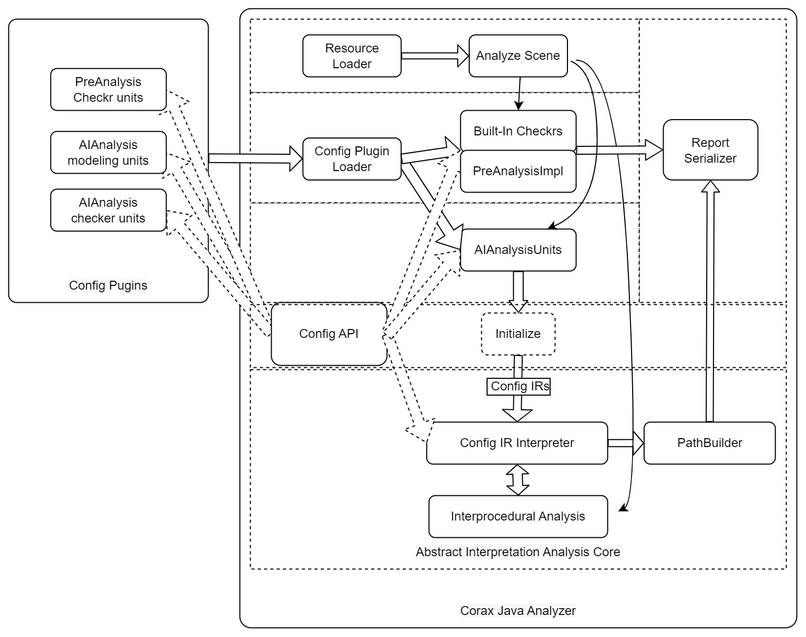
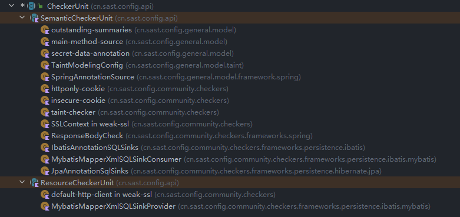
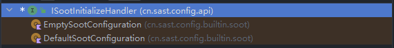

# 插件项目结构

**Table of contents**

[[_TOC_]]

## 插件项目架构

### System Overview

（非完整）社区版的架构如下图：




### 插件结构

```
.
├── build
│   ├── analysis-config                                  // 本配置项目生成的最终产物
│   │   ├── plugins
│   │   │   ├── feysh-config-commercial-plugin-2.0-SNAPSHOT.zip  // commercial checker 插件，依赖通用插件
│   │   │   ├── feysh-config-community-plugin-2.0-SNAPSHOT.zip // community checker 插件，依赖通用插件
│   │   │   └── feysh-config-general-plugin-2.0-SNAPSHOT.zip   // 通用插件
│   │   └── rules   // 不仅仅只包含 taint 规则, 由默认通用的 com.feysh.corax.config.general.rule.RuleManager 进行加载管理，也可以自定义格式加载
│   │       ├── commercial.sinks.json                            // commercial 插件依赖的 sink 数据
│   │       ├── clear.summaries.json                           // java 容器 clear 方法摘要数据枚举
│   │       ├── community.sinks.json                           // community 插件依赖的 sink 数据
│   │       ├── general.sources.json                           // 两个插件都依赖的 source 数据
│   │       ├── general.summaries.json                         // 两个插件都依赖的 summary 数据
│   │       ├── javaseccode.summaries.json                     // javaseccode 的 summary (sanitizer) 数据
│   │       ├── owasp.summaries.json                           // owasp benchmark 的 summary (sanitizer) 数据
│   │       ├── public-checkers.access-path.json               // 一些 checker 依赖的根据 kind 分组的一些数据（access path）
│   │       ├── supplement.sinks.json                          // 补充的 sink 数据
│   │       ├── supplement.sources.json                        // 补充的 source 数据
│   │       └── supplement.summaries.json                      // 补充的 summary 数据
│   ├── ...
├── corax-config-api                                     // 项目模块。一个 api wrapper, 实际是从引擎中获得 corax-config-api.jar
│   ├── build
│   │   ├── ...
│   └── build.gradle.kts                                       // gradle kotlin 配置脚本，空的 api wrapper
├── corax-config-community                                     // 项目模块。主要包含 checker 的定义
│   ├── build
│   │   ├── ...
│   ├── build.gradle.kts                                       // gradle kotlin 配置脚本
│   ├── gradle.properties                                      // gradle 配置, 定义插件 pluginId、ginProvider、pluginDependencies
│   ├── rules                                                  // 会自动 copy 到 build/analysis-config/rules
│   │   ├── community.sinks.json                               // community 插件依赖的 sink 数据，
│   │   └── public-checkers.access-path.json                   // 依赖的根据 kind 分组的一些数据
│   └── src                                                    // 插件源代码目录
│       ├── main
│       │   └── kotlin                                         // 插件源码，可以混合编写 kotlin, java 代码
│       │   └── resources                                      // 插件资源
│       └── test
│           ├── kotlin                                         // 插件单元测试源码
│           └── resources                                      // 插件单元测试资源
├── corax-config-general                                 // 项目模块。定义一些通用的类和工具
│   ├── build
│   │   ├── ...
│   ├── build.gradle.kts
│   ├── gradle.properties
│   ├── rules                                                   // 会自动 copy 到 build/analysis-config/rules
│   │   ├── clear.summaries.json                                // 参考最上面的 build/analysis-config/rules 描述
│   │   ├── general.sources.json
│   │   ├── general.summaries.json
│   │   ├── javaseccode.summaries.json
│   │   ├── owasp.summaries.json
│   │   ├── supplement.sources.json
│   │   └── supplement.summaries.json
│   └── src
│       ├── main
│       │   ├── kotlin                                          // 源码
│       │   └── resources                                       // 资源
│       └── test
│           ├── kotlin
│           └── resources
├── corax-config-tests                                    // 项目模块。通过手动编写测试用例，标注缺陷代码和相应的合规代码，
│                                                                // 用来检查分析器和checker误漏报
│   ├── build
│   │   ├── ...
│   ├── build.gradle.kts
│   ├── libs                                                     // 依赖的三方库
│   │   └── platforms                                            // android platforms
│   │       └── android-7
│   │           └── android.jar
│   └── src
│       └── main
│           ├── java                                             // testcases
│           └── kotlin
├── docs                                                  // 详细文档
│   ├── ...
├── gradle                                                // gradle wrapper
│   └── wrapper
│       ├── ...
├── Readme.md
├── build.gradle.kts                                      // gradle kotlin 配置脚本
├── build.local.env.gradle.kts
├── gradle-local.properties                               // 需要手动填写 corax_cli 引擎的全路径
├── gradle.properties                                     // gradle 常量配置
├── gradlew
├── gradlew.bat
└── settings.gradle

```


## 基础类型

字母 I 开头的类一般都是接口

### IStandard

​		每种标准集包很多的 Rule,（比如 cwe 标准及包含 cwe-78，cwe-79 等等 Rules），一个类型的漏洞一般会有一到多个标准集中的 Rule 与之对应。

​		内置有如下几种内置的类型的标准集合

- BuiltinGeneralStandard.[CWE](https://cwe.mitre.org/)
- BuiltinGeneralStandard.[CERT](https://wiki.sei.cmu.edu/confluence/display/java/2+Rules)
- BuiltinGeneralStandard.FEYSH

内置定义如下，您可以仿照新建一个标准集进行扩展，仅需实现 IStandard 接口

```kotlin
package com.feysh.corax.config.builtin.standard
enum class BuiltinGeneralStandard(
    override val realName: String,
    override val desc: String
) : IStandard {
    FEYSH("feysh", "feysh standard"),
    CWE("cwe", "Common Weakness Enumeration. https://cwe.mitre.org/index.html"),
    CERT("cert", "SEI CERT Oracle Coding Standard for Java. https://wiki.sei.cmu.edu/confluence/display/java"),
}
```


### IRule

​		IRule 接口类型的对象就是标准集下的一条 Rule。

​		在引擎中内置了几个 CWE Rules, 定义如下：

```kotlin
package com.feysh.corax.config.builtin.standard
enum class BuiltinCWERules(
    override val realName: String,
    override val desc: String
) : IRule {
    CWE476_NULLPointer("cwe-476","NULL Pointer Dereference"),
    CWE561_DeadCode("cwe-561","Contains dead code, which can never be executed."),
    CWE563_UnusedVariable("cwe-563","Assignment to Variable without Use"),
    ;
    // 规定上述定义的枚举类型均属于 BuiltinGeneralStandard.CWE 标准集
    // 通过 BuiltinCWERules.CWE476_NULLPointer.standard 即可得到 BuiltinGeneralStandard.CWE
    override val standard: IStandard = BuiltinGeneralStandard.CWE
}
```

您可以仿照此 Rules 的定义进行扩展，[CWERules.kt](/corax-config-community/src/main/kotlin/com/feysh/corax/config/community/standard/CWERules.kt)


### IBugCategory

​		bug 的类型定义接口。一个 bug 可以使用不同的分类进行描述，可以用来辅助理解危害类别和方便管理。分类可以逐级细分，所以一个类型的分类往往包含多个父分类类型（填写 IBugCategory.parent 字段来描述）。

​		在引擎中内置了几个 BuiltinBugCategory, 定义如下：

```kotlin
package com.feysh.corax.config.builtin.category

import com.feysh.corax.config.api.IBugCategory


enum class BuiltinBugCategory(
    override val parent: Set<IBugCategory>,
    override val realName: String,
    override val desc: String,
) : IBugCategory {

    // level 1
    SECURITY(emptySet(), "Security", "A use of untrusted input in a way that could create a remotely exploitable security vulnerability."),
    PERFORMANCE(emptySet(), "Performance", "Code that is not necessarily incorrect but may be inefficient."),
    Style(emptySet(), "Dodgy Code", "Code that is confusing, anomalous, or written in a way that leads itself to errors."),
    EXPERIMENTAL(emptySet(), "Experimental", "Experimental and not fully vetted bug patterns"),
    Quality(emptySet(), "Quality", "low-quality code"),

    // level 2
    Injection(setOf(SECURITY), "Injection", "Injection flaws are very prevalent, particularly in legacy code. Injection vulnerabilities are often found in SQL, LDAP, XPath, or NoSQL queries, OS commands, XML parsers, SMTP headers, expression languages, and ORM queries. Injection flaws are easy to discover when examining code."),
    SensitiveDataExposure(setOf(SECURITY), "unencrypted sensitive data exposure", ""),
    Misuse(setOf(SECURITY), "misuse", ""),

    // level 3
    NullPointer(setOf(Quality), "null pointer",""),
    DeadCode(setOf(Quality), "dead code",""),
    DefineUnused(setOf(Quality), "define unused",""),
    DeadStore(setOf(Quality), "dead store",""),
    ;
}

```

您可以仿照此 Category 的定义进行扩展 [BugCategory.kt](/corax-config-community/src/main/kotlin/com/feysh/corax/config/community/category/BugCategory.kt)


### IChecker

​		定义一个checker用来检查一系列相似的问题，一个 checker 可以包含多个 CheckType

​		如：使用 kotlin object 定义一个 名为 SqliChecker 的  Checker 并实现  IChecker 接口

```kotlin
object SqliChecker : IChecker {
    override val report: IRule =  CWERules.CWE89_SQLI       // 报告中最终使用的 bug rule 名字来自该字段
    override val category: IBugCategory = BugCategory.Sqli  // 报告中最终使用的 bug 分类 名字来自该字段
    override val standards: Set<IRule> = setOf(             // 填写此检查器属于哪些通用标准集 Rule
        CWERules.CWE89_SQLI,
    )
    
    CheckTypes ...
}
```

您可以仿照此 Checker 的定义进行扩展 [CheckerDeclarations.kt](/corax-config-community/src/main/kotlin/com/feysh/corax/config/community/CheckerDeclarations.kt)


### CheckType

​		一般定义在 Checker 定义的内部，如下面代码所示：

```kotlin
object SqliChecker : IChecker {

    // CheckType
    object SqlInjectionTyped : CheckType() {  // 继承 CheckType 类
        override val bugMessage: Map<Language, BugMessage> = mapOf(  // 定义报告中的中英文关键信息，可以扩展其他语言
            Language.ZH to msgGenerator { "使用  ${args["type"]} 中的 `$callee` 可能容易受到 SQL 注入的攻击"},
            Language.EN to msgGenerator { "This use of `$callee` can be vulnerable to SQL injection in the ${args["type"]} " }
        )
        override val checker: IChecker = SqliChecker // 需要填写此 CheckType 属于哪个 checker, 一般为外部类（SqliChecker）
    }
    
    CheckTypes ...
 }
```

​		您可以仿照此 Checker 的定义进行扩展 [CheckerDeclarations.kt](/corax-config-community/src/main/kotlin/com/feysh/corax/config/community/CheckerDeclarations.kt)


#### Language

​		定于报告的语言，目前仅支持中文（Language.ZH）和英文（Language.EN），且报告中中英文同时存在，如有需要再做成可自定义报告输出语言


#### BugMessage

​		通过 kotlin 方法  `msgGenerator ` 生成报告中的路径和 bug 信息生成器。

​		假如存在如下 java 代码方法调用：

```java
class Foo{
    void containerA() {
        
        // 假如实际调用 <Bar: String calleeB()>
        // 调用点所在的方法 container: <Foo: void containerA()>
        // 调用点 Stmt: jimple ir: $r = virtualInvoke $this.<Foo: Object calleeB()>()
        // 调用点的 invokeExpr 即 virtualInvoke $this.<Foo: Object calleeB()>()
        // 调用边的 target 即 <Bar: String calleeB()>, 非 <Foo: Object calleeB()>
        Object r = calleeB(); 
        
        
        // 假如实际调用 <Foo: java.sql.Statement JdbcSqlSinkA(java.lang.Object)>
        // 调用点所在的方法 container: <Foo: void containerA()>
        // 调用点 Stmt: jimple ir: $r = virtualInvoke $this.<Foo: java.sql.Statement JdbcSqlSinkA(java.lang.Object)>()
        // 调用点的 invokeExpr 即 virtualInvoke $this.<Foo: java.sql.Statement JdbcSqlSinkA(java.lang.Object)>()
        // 调用边的 target 即 <Foo: java.sql.Statement JdbcSqlSinkA(java.lang.Object)>
        JdbcSqlSinkA(r);
    }
    
    @Override Object calleeB(){
        ...
    }
}
class Bar extends Foo {
    @Override String calleeB(){
        ...
    }
}
```


```kotlin
data class BugMessage(val msg: Env.() -> String) {
    interface Env {
        val container: SootMethod?     // 调用点所在的方法
        val callSite: soot.Unit?       // 调用点 stmt
        val invokeExpr: InvokeExpr?    // 调用点 invokeExpr
        val callee: SootMethod?        // 调用边的 target

        val clazz: SootClass?          // PreAnalysisUnit.IClassCheckPoint 中定义的 java class 检查会填写该字段
        val method: SootMethod?        // PreAnalysisUnit.IMethodCheckPoint 中定义的 java method 检查会填写该字段
        val field: SootField?          // PreAnalysisUnit.IFieldCheckPoint 中定义的 java field 检查会填写该字段
        val fileName: String?          // PreAnalysisUnit.ISourceFileCheckPoint 中定义的资源文件检查会填写资源文件名字

        var lineNumber: Int            // bug 所在行数
        var columnNumber: Int          // bug 所在列数

        val args: MutableMap<Any, Any> // checker unit 中自定义的数据可以存入此 args map
    }
}

fun msgGenerator(msg: BugMessage.Env.() -> String) = BugMessage(msg)

```


​		列入在上述位置报告 bug 时

```kotlin
msgGenerator { "使用 ${args["type"]} 中的 $callee 可能容易受到 SQL 注入的攻击"}
```

​		即可生成对应的 message:  `"使用 JdbcSqlSink 中的 <Foo: java.sql.Statement JdbcSqlSinkA(java.lang.Object)> 可能容易受到 SQL 注入的攻击"`


### SAOptions

​		通过添加自定义的可序列化类，方便快捷地从 外部 yml 配置此对象的各个字段，参考 [Readme.md#编译构建](/Readme-zh.md#编译构建) ，打开生成的 yml 配置文件再找到 SSLContext Unit 中的 options 字段，更改配置并保存，在下次分析时分析器会自动反序列化此 yml 文件成一个 SSLContext.Options 并填写到 SSLContext.options 字段，再调用 AIAnalysisUnit.config 方法，此时 options.riskAlgorithm 中的配置开始生效。

```kotlin
object SSLContext : AIAnalysisUnit() { // 必须继承 CheckerUnit
    
    @Serializable // kotlin serialization 注解，保证此类可以被自动序列化和反序列化
    class Options : SAOptions {
        val riskAlgorithm = listOf("SSl", "SSLv2", "SSLv3", "TLS", "TLSv1", "TLSv1.1") // 默认配置数据
    }

    private var options: Options = Options() // 必须设置为 var, 不可使用 kotlin val 关键子或者 添加 java final 修饰
    
    context (AIAnalysisApi)
    override fun config() {
        options.riskAlgorithm // 读取可外部自定义的配置
    }
}
```

​		完整代码请前往 [weak-ssl.kt](/corax-config-community/src/main/kotlin/com/feysh/corax/config/community/checkers/weak-ssl.kt)


### IMethodMatch

通过一些方法的关键信息（如方法所在的类名字，方法名，参数类型，参数数量等等）来匹配多个 soot.Scence 中的 soot.SootMethod。

#### SootSignatureMatch

内置的，通过 soot method signature 来匹配唯一对应的  soot.SootMethod

如 `matchSoot(sootSignature="<Foo: Object calleeB()>()")` 仅仅可得到一个 soot.SootMethod: `<Foo: Object calleeB()>()` （如果存在此SootMethod）

#### RawSignatureMatch

内置的，通过 soot method signature 来模糊地匹配一到多个对应的  soot.SootMethod

- \* 表示匹配任意类型
- \*\* 表示匹配 0 到 多个 类型

如 `matchSimpleSig(sig="java.lang.String: * <init>(char[],*,**)")` 可以匹配到 

```
0 = "<java.lang.String: void <init>(char[],int)>"
1 = "<java.lang.String: void <init>(char[],int,int)>"
2 = "<java.lang.String: void <init>(char[],int,int,java.lang.Void)>"
```


如 `matchSimpleSig(sig="java.lang.String: * <init>(char[],**)")` 可以匹配到 

```
0 = "<java.lang.String: void <init>(char[])>"
1 = "<java.lang.String: void <init>(char[],int)>"
2 = "<java.lang.String: void <init>(char[],int,int)>"
3 = "<java.lang.String: void <init>(char[],int,int,java.lang.Void)>"
```

​		正如你看到的这 4 个 soot signatures，只有类型和参数数量之分，很难知道每个参数什么作用，这样无论是用户还是开发者都很难知道该方法参数的用法，也就很难编写摘要和检查。

​		**simple sig 是支持填写变量名的，对分析没有实际作用，只是用来帮助我们理解方法含义的，格式为 `short type name + 加空格 + 变量名` ，建议填写变量名。**

如：

​	`javax.net.ssl.SSLSocket: void setEnabledProtocols(String[] protocols)` 

​	`java.lang.String: void <init>(char value[], int offset, int count)`

另外 soot signature 是不支持变量名的。以后可以支持，或自定义格式。


### IMethodGrouped

定义的完整源码 [rule/RuleDeclares.kt](/corax-config-general/src/main/kotlin/com/feysh/corax/config/general/rule/RuleDeclares.kt)

一个接口，继承 `IMethodSignature` 并包含 `group: String ` 字段

也就是 一个 `group kind` + 一个方法的 `signature { signature，subtypes，provenance，ext  }`

例如下面这条 rule 就是一个 kind字段 加上一个完整 `IMethodSignature`， 合起来就是一个 `IMethodGrouped`

```json
{"kind":"content-provider","signature":"<javax.swing.text.JTextComponent: java.lang.String getText(int,int)>","subtypes":true,"provenance":"manual","ext":""}
```

比如此 rule 文件中: [general.sources.json](/corax-config-general/rules/general.sources.json)

### RuleManager

定义的完整源码 [rule/RuleManager.kt](/corax-config-general/src/main/kotlin/com/feysh/corax/config/general/rule/RuleManager.kt)

一个配置文件管理器，基于 `kotlinx-serialization` 方便快捷地加载解析文件和序列化一些对象到文件

在 [model/ConfigCenter.kt](/corax-config-general/src/main/kotlin/com/feysh/corax/config/general/model/ConfigCenter.kt) 中有一段代码如下

```kotlin
val methodAccessPathDataBase: GroupedMethodsManager<MethodAccessPath> by lazy { // 延迟加载，第一次访问时执行
    // 从 rules 文件夹中搜索所有满足 `file.name.endsWith("access-path.json")` 的文件
    val sourcesJsonFiles = walkFiles(getConfigDirectories()){ file -> file.name.endsWith("access-path.json") }
    // 将这些文件使用 serializer<MethodAccessPath>() 反序列化，并将结果返回给 Lazy
    return@lazy GroupedMethodsManager.load<MethodAccessPath>(sourcesJsonFiles, serializer = serializer())
}
```

仿照此方法，您可以很方便自定义任意格式的文件来加载和保存一些数据，仅需要定义一个 kotlin 可序列化的数据类


### ConfigCenter

定义的完整源码 [model/ConfigCenter.kt](/corax-config-general/src/main/kotlin/com/feysh/corax/config/general/model/ConfigCenter.kt) 

用来加载 [build/analysis-config/rules](/build/analysis-config/rules) 中的一些文件，包含 `taint (source, sink, summary) json` 配置文件 和 `access-path.json` 配置文件

分别对应 `ConfigCenter.taintRulesManager` 和 `ConfigCenter.methodAccessPathDataBase`


### CheckerUnit

tips：更多详细示例可以参考  [自定义checker](checker-detail.md)

一个 checker 单元的基类，分为  `PreAnalysisUnit` 和 `AIAnalysisUnit`




#### PreAnalysisUnit

一种 checker 定义单元，主要检查和解析资源，引擎会内置提供如下检测能力：

- 项目的资源（比如 `.txt, .xml, .config, .java, .yml, .key, etc ...`）内容，可自定义
- `SootClass, SootField, SootMethod jimple IR, Annotations` 检查
- Java 方法调用检查 (call edge)
- Java class AST match ([javaparser](https://github.com/javaparser/javaparser))


##### PreAnalysisApi

提供了如下检查器接口

```kotlin
object ExampleCheckerName : PreAnalysisUnit() {
    context (PreAnalysisApi)
    override fun config() {
    	val cg: CallGraph                // 调用图，精度受 --call-graph-algorithm 影响，PAG 可以通过 Scene.v().pointsToAnalysis 得到
    	runInScene{}                     // 回调被调用时，会提供完整的 soot scene 环境(call graph, pointsToGraph 等等)，可以在回调中实现一些特殊检查
        atAnyClass(){ }                  // 遍历所有的 SootClass
        atAnyField(){ }                  // 遍历所有的 SootField
        atAnyMethod(){ }                 // 遍历所有的 SootMethod
        atAnyInvoke(){ }                 // 遍历所有的 Java 方法调用点 (call edge)
        atAnySourceFile(extension=?){ }  // 遍历所有的 特定后缀 的资源文件
        
        atClass(clazz){ }                // 匹配指定的 SootClass
        atField(field){ }                // 匹配指定的 SootField
        atMethod(method){ }              // 匹配指定的 SootMethod
        atInvoke(callee){ }              // 返回调用了 callee 方法的调用点 (call edge)
        
        // 缺陷报告提交
    	fun ICheckPoint.report(checkType: CheckType, env: BugMessage.Env.() -> Unit = { })
    	fun report(checkType: CheckType, atClass: SootClass, startLineNumber: Int, columnNumber: Int, env: BugMessage.Env.() -> Unit = {})
    	fun report(checkType: CheckType, file: Path, startLineNumber: Int, columnNumber: Int, env: BugMessage.Env.() -> Unit = {})
    }
}
```


#### AIAnalysisUnit

是抽象解释分析的自定义检查单元，主要检查分析代码的语义，引擎会内置提供如下 API 来构造自定义检查器：

- 方法的建模描述，可以扩展一些属性并绑定到对象上
- 检查 bug 


##### AIAnalysisApi

```kotlin
object IbatisAnnotationSQLSinks : AIAnalysisUnit() {

    context (AIAnalysisApi)
    override fun config() {
    	beforeConfig{}           // 配置开始前调用
        eachClass{}              // 遍历并 handle 所有的 SootClass
        eachField{}              // 遍历并 handle 所有的 SootField
        eachMethod{}             // 遍历并 handle 所有的 SootMethod
        eachLocalVariable{}      // 遍历并 handle 所有的 SootMethod 中的局部变量
        
        constructor(KMethod){}    // handle 一个 构造函数
        method(KMethod){}         // handle 一个 成员方法
        staticMethod(KMethod){}   // handle 一个 静态方法
        
        clazz(classMatch){}       // handle 匹配指定的类
        field(localVarMatch){}    // handle 匹配指定的类成员字段
        method(methodMatch){}     // handle 匹配指定的类方法
        localVar(localVarMatch){} // handle 匹配指定的 SootMethod 中的局部变量
        afterConfig{}             // 配置结束后调用
    }
}
```


### ISootInitializeHandler

用来自定义配置 soot Scene 的相关参数。

内置有如下两个对象



源码如下

```kotlin
package com.feysh.corax.config.builtin.soot

import com.feysh.corax.config.api.ISootInitializeHandler

@Suppress("unused")
object EmptySootConfiguration: ISootInitializeHandler

object DefaultSootConfiguration : ISootInitializeHandler {
    @Serializable
    class CustomOptions : SAOptions {
        val excludeList: List<String> = listOf(
            "java.*",
            "javax.*",
            "jdk.*",

            "com.apple.*",
            "apple.awt.*",
            "org.w3c.*",
            "org.xml.*",
            "com.sun.*",
            "sun.*",

            // exclude classes of android.* will cause layout class cannot be
            // loaded for layout file based callback analysis.

            // 2020-07-26 (SA): added back the exclusion, because removing it breaks
            // calls to Android SDK stubs. We need a proper test case for the layout
            // file issue and then see how to deal with it.
            "android.*",
            "androidx.*",

            // logger
            "org.slf4j.*",
            "org.apache.log4j.*",
            "org.apache.logging.*",
            "java.util.logging.*",
            "ch.qos.logback.*",
            "com.mysql.*",

            // "org.apache.*",
            "org.eclipse.*",
            "soot.*"
        )

        val sootPhaseNameToOption: Map<String, String> = mapOf(
            "jb.sils" to "enabled:false", // null_type bug
            "jb.tr" to "ignore-nullpointer-dereferences:true", // don't replace to npe
        )
    }

    var options: CustomOptions = CustomOptions()

    override fun configure(options: Options) {
        // explicitly include packages for shorter runtime:
        val excludeList: MutableList<String> = LinkedList()
        excludeList.addAll(this.options.excludeList)
        //  soot.Options exclude 掉的类仅加载其 signature，不会加载任何 method body
        //  可以加快扫描速度，减少不关心的类的分析，但是可能降低分析精度
        options.set_exclude(excludeList)
        for ((phaseName, opt) in this.options.sootPhaseNameToOption) {
            options.setPhaseOption(phaseName, opt)
        }
    }
}

```

`DefaultSootConfiguration` 为分析器默认的 soot scene 配置，不手动指定将情况下分析器会默认打开。


完整示例：`com.feysh.corax.config.builtin.soot.DefaultSootConfiguration`

